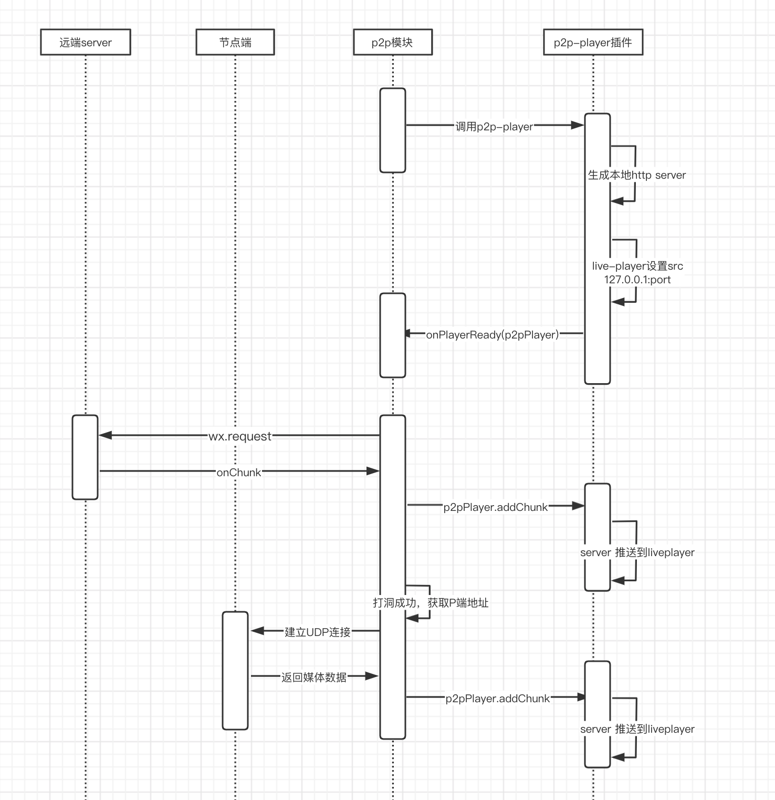

# 腾讯云IoT  Video P2P-Player 插件开发指南

## 插件CHANGELOG

| 版本号 | 发布时间  | 描述              |
| ------ | --------- | ----------------- |
| v1.0.0.beta | 2021.7.19 | 支持小程序P2P内测版 |
| v1.0.0 | 2021.8.10 | 增加支持多播放器 |


## 插件介绍

`p2p-player`扩展了微信的`live-player`组件，支持播放来自本地js模块的视频数据流，主要应用在`P2P视频`等场景。此类场景下视频源并不是来自远端的视频服务器，而是来自于某个P端节点的，该节点并没有域名甚至没有外网IP，无法直接通过设置`live-player`的`src`直接拉取节点的视频数据。本地js模块可以通过`P2P打洞`等技术获取到视频数据（至于技术细节不在这里赘述，可自行了解），然后通过本插件将获取到的视频数据吐给`live-player`，完成正常的视频播放。

## 插件原理

详见以下原理图


关键步骤说明：
- step1.调用插件中的`p2p-player`的自定义组件
- step2.`p2p-player`的自定义组件初始化一个本地的`http-server`，自动监听某个本地端口
- step3.设置`live-player`中的`src`属性为本地`127.0.0.1:port`的地址
- step4.完成初始化，外部调用方得到`p2p-player`暴露的方法
- step5.外部调用方开始获取视频数据，并通过`p2p-player`暴露的方发`addChunk`来将数据吐给`live-player`

## 微信版本限制

微信 8.0.10 以上
基础库 2.19.3 以上

## 使用方法

### 1. 申请使用插件

小程序后台添加插件，详见[官方文档](https://developers.weixin.qq.com/miniprogram/dev/framework/plugin/using.html)
``` js
appid: 'wx9e8fbc98ceac2628'
```

### 2. 在配置中引入插件
```js
// app.json
{
  "pages": [
    // 自行定义
    "pages/index/index"
  ],
  "plugins": {
    "wechat-p2p-player": {
      // version自行定义
      在代码配置中"version": "dev",
      "provider": "wx9e8fbc98ceac2628"
    }
  },
  "sitemapLocation": "sitemap.json",
  "usingComponents": {
    "p2p-player": "plugin://wechat-p2p-player/p2p-player"
  }
}

```
```js
// pages/index/index.json
{
  "usingComponents": {
    "p2p-player": "plugin://wechat-p2p-player/p2p-player"
  }
}
```

### 3. 使用插件
> 导出的是一个自定义组件，所以在`wxml`中引用
```html
<p2p-player
  id="{{playerId}}"
  bind:playerReady="onPlayerReady"
  bind:playerStartPull="onPlayerStartPull"
  bind:playerClose="onPlayerClose"
  bind:playerError="onPlayerError"
/>
```

## 4. 代码示例

见 [小程序demo](./demo/miniprogram)

## API 说明

### 组件参数说明
|  参数    | 类型   |  默认值  | 是否必填 |  说明   |
|  ----   | ----   | ----    | ----   | ----  |
| id  | string | 无 | 必填 | player id为唯一标示 |
| bind:playerReady  | Function | 无 | 必填 | 本地`http-server`初始化完的回调，将返回`livePlayerContext` 可以直接对`live-player`的context进行操作，具体见`live-player`小程序文档 |
| bind:playerStartPull  | Function | 无 | 必填 | `live-player`开始播放之后，开始拉流的回调，这个时候可以开始触发addChunk的方法，进行吐流 |
| bind:playerClose  | Function | 无 | 非必填 | `live-player`停止或者暂停之后的回调 |
| 其他  | 无 | 无 | 非必填 | `live-player`的其他非必填参数的透传，具体见`live-player`小程序文档|

### 插件导出的方法说明
> 通过自定义组件支持的方法获取到当前组件，就可以访问到相应的方法，调用方式如下：
```js
const p2pPlayer = this.selectComponent(`#${this.data.playerId}`);
```

|  方法名    |  传参   |  说明   |
|  ----   | ----   | ----    |
| addChunk | data `ArrayBuffer` `必填` `视频数据` | 往`p2p-player`里面推流
| finishMedia | data `ArrayBuffer` `非必填` `视频数据` | 结束推流