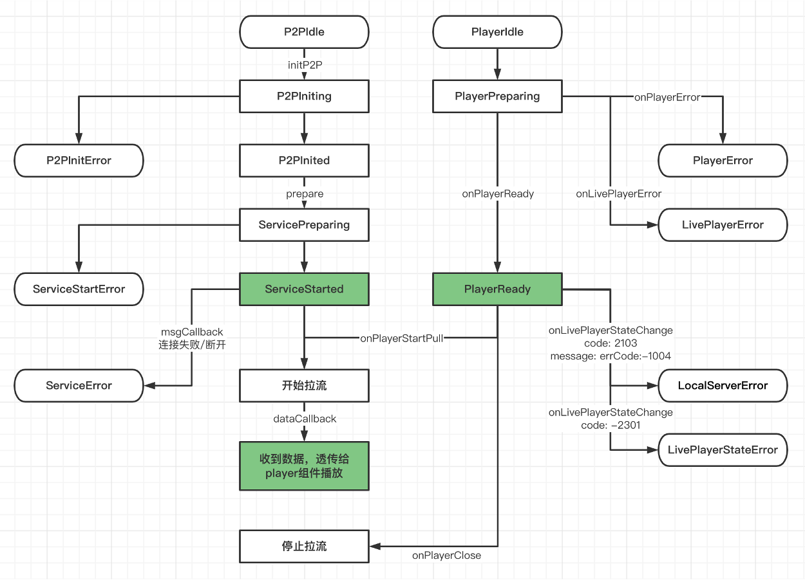

# 腾讯云物联网 IoT Video X-P2P 插件开发指南

## 插件CHANGELOG

| 版本号 | 发布时间  | 描述                             |
| ------ | --------- | -------------------------------- |
| 1.0.0.beta | 2021.7.19 | 支持小程序P2P初版，支持1V多P2P和1V1P2P观看摄像头实时监控流的内测beta版本 |
| 1.0.0 | 2021.8.10 | 增加加密和支持1V1 P2P 语音对讲和自定义信令 |
| 1.0.1 | 2021.10.21 | 增加限制设备端版本，最低2.3.0 |
| 1.0.2 | 2021.11.24 | stunServer支持DNS |
| 1.0.3 | 2021.12.16 | 开发版小程序支持关闭流加密 |
| 1.1.0 | 2021.12.27 | 优化1v多，server端提供https流，不用另外部署code服务 |
| 1.1.1 | 2022.3.2 | 检测到本地NAT发生变化时通知调用方 |
| 1.2.0 | 2022.3.10 | 新增本地文件下载功能 |
| 1.3.0 | 2022.3.22 | 支持发送自定义的语音数据 |

## 插件介绍

### 功能
#### 1V多 P2P

传统的多人观看场景，观看端向云端发送HTTP请求获取数据。

在腾讯云IoT Video 1V多 P2P服务中，观看端和云端建立一个共享P2P网络。通过P2P，客户可以互相分享数据，从而大幅降低云端流量，节省相关成本。

#### 1V1 P2P

支持在微信小程序内通过P2P方式直连摄像头观看直播和本地录像。

### 原理

本插件是 P2P 的一个小程序Peer
- 客户小程序利用 ***P2P-Player插件*** 将live-player的请求发送至 ***本插件***
- ***本插件*** 从云端或其他P2P节点获取数据，并持续返回给客户小程序
- 客户小程序再将数据持续推送至 ***P2P-Player插件***，从而实现P2P播放功能

支持的流媒体：http-flv。

## 准备工作

使用本插件需要：

- 接入腾讯云 IoT Video P2P 服务，获取访问密钥等信息（即后文中的`appParams`）
- 申请使用 `xp2p插件(wx1319af22356934bf)` 和 `p2p-player插件(wx9e8fbc98ceac2628)` 
- 有使用 live-player 的权限，详见 [live-player官方文档](https://developers.weixin.qq.com/miniprogram/dev/component/live-player.html)
- 如果使用 1v多 模式，需要将flv流的域名加到小程序的 `request合法域名` 和 `tcp合法域名` 配置中，详见 [服务器域名配置官方文档](https://developers.weixin.qq.com/miniprogram/dev/framework/ability/network.html#1.%20%E6%9C%8D%E5%8A%A1%E5%99%A8%E5%9F%9F%E5%90%8D%E9%85%8D%E7%BD%AE)

## 微信版本限制

- 1v1：微信 8.0.10 以上，基础库 2.19.3 以上
- 1v多：微信 8.0.14 以上，基础库 2.20.2 以上

## 使用方法

本插件需配合 [P2P-Player插件](./IoT%20Video%20P2P-Player%E6%8F%92%E4%BB%B6%E5%BC%80%E5%8F%91%E6%8C%87%E5%8D%97.md) 使用，请先引用 *P2P-Player插件*

### 1. 申请使用插件

小程序后台添加插件，详见[官方文档](https://developers.weixin.qq.com/miniprogram/dev/framework/plugin/using.html)
``` js
// p2p-player，负责提供数据给 live-player 播放
appid: 'wx9e8fbc98ceac2628'

// xp2p，负责从其他peer获取数据
appid: 'wx1319af22356934bf'
```

申请通过后可以尝试运行demo项目，熟悉基本功能

demo项目地址：https://github.com/tencentyun/iot-video-p2p-doc/tree/master/demo/miniprogram

运行前需要修改一些配置：
- 替换 project.config.json 里的小程序 appid
- 替换 config/config.js 里的客户参数 appParams
- 1v1模式，替换 config/devcies.js 里预置的设备信息
- 1v多模式，替换 config/streams.js 里预置的server流信息

注意事项：
- 要求微信 8.0.10 以上，基础库 2.19.3 以上，低版本需提示升级
- 开发者工具不支持 live-player 和 TCPServer，所以不能在开发者工具中调试，也不支持真机调试，需使用二维码预览的方式在真机运行


### 2. 在自有小程序的配置中引入插件

``` js
// 在app.json里面引入插件，注意尽量用最新的插件版本号
{
  "plugins": {
    "wechat-p2p-player": {
      "version": "1.0.2",
      "provider": "wx9e8fbc98ceac2628"
    },
    "xp2p": {
      "version": "1.1.1",
      "provider": "wx1319af22356934bf"
    }
  }
}
```

### 3. 在自有小程序中使用插件

p2p监控需要2个插件配合使用，参考 demo 中的组件 [iot-p2p-common-player](./demo/miniprogram/components/iot-p2p-common-player)。

1v1和1v多有各自的功能特性，参考 demo 中的组件 [iot-p2p-player-ipc](./demo/miniprogram/components/iot-p2p-player-ipc) 和 [iot-p2p-player-server](./demo/miniprogram/components/iot-p2p-player-server)，他们在 common-player 的基础上进行了简单扩展。

具体流程如下：

#### 3.1 1v多


初始化时会用到接入腾讯云 IOT Video P2P 服务时收到的 `appParams`

``` js
// 获取插件
const videoPlugin = requirePlugin('iotvideo-weapp-plugin');
const p2pModule = videoPlugin.p2p;
```

``` js
// 初始化 IoTP2PModule，建议尽早初始化，提前探测网络状态
p2pModule
  .init({
    appParams: {
      appid: $yourTCloudAppId,
      appOauthId: $yourAppOauthId,
      appKey: $yourAppKey,
      appSecretKey: $yourAppSecretKey,
      appPackage: $yourAppPackage,
    },
    eventHandler: (event, detail) => {
      // 各种本地NAT相关的事件通知，取值见api说明，要求最低版本 1.1.1
    },
  })
  .then((res) => {
    // res === 0 说明初始化成功
    console.log('init res', res);
  })
  .catch(({ errcode, errmsg }) => {
    console.error('init error', errcode, errmsg);
  });

```

``` js
// 在 p2p-player 插件开始请求后启动p2p通信，注意不能同时存在相同的 streamId
p2pModule.startP2PService(streamId, streamInfo, {
  msgCallback: (event, subtype, detail) => {
    // 各种消息通知，取值见api说明
  },
  dataCallback: (data) => {
    // data 是 ArrayBuffer 类型，在这里把数据推送给 p2p-player
  },
});

```

``` js
// 在 p2p-player 插件结束请求后关闭p2p通信
// 1.3.0 之前需使用旧接口名 stopServiceById
p2pModule.stopP2PService(streamId);

```

``` js
// 销毁 IoTP2PModule，可以在小程序销毁时一并销毁
p2pModule.destroy();

```

#### 3.2 1v1


基本流程和1v多类似，初始化时也会用到接入腾讯云 IOT Video P2P 服务时收到的 `appParams`

``` js
// 获取插件
const videoPlugin = requirePlugin('iotvideo-weapp-plugin');
const p2pModule = videoPlugin.p2p;
```

``` js
// 初始化 IoTP2PModule，建议尽早初始化，提前探测网络状态
p2pModule
  .init({
    appParams: {
      appid: $yourTCloudAppId,
      appOauthId: $yourAppOauthId,
      appKey: $yourAppKey,
      appSecretKey: $yourAppSecretKey,
      appPackage: $yourAppPackage,
    },
    eventHandler: (event, detail) => {
      // 各种本地NAT相关的事件通知，取值见api说明，要求最低版本 1.1.1
    },
  })
  .then((res) => {
    // res === 0 说明初始化成功
    console.log('init res', res);
  })
  .catch(({ errcode, errmsg }) => {
    console.error('init error', errcode, errmsg);
  });

```

``` js
// 为了提高出图速度，在开始播放前可以先建立p2p连接，注意不能同时存在相同的 ipcId
p2pModule.startP2PService(ipcId, ipcInfo, {
  msgCallback: (event, subtype, detail) => {
    // 各种消息通知，取值见api说明
  },
});

```

``` js
// 支持修改 callbacks
p2pModule.updateServiceCallbacks(ipcId, {
  msgCallback: (event, subtype, detail) => {
    // 各种消息通知，取值见api说明
  },
});

```

``` js
// 在 p2p-player 插件开始请求后启动p2p拉流，注意需要先调用 startP2PService
// 1.3.0 之前需使用旧接口名 startP2PStream
p2pModule.startStream(ipcId, {
  // 不指定 flv 就从 startP2PService 的参数里解析
  flv: {
    filename: 'ipc.flv',
    params: 'action=live&channel=0&quality=high',
  },
  dataCallback: (data) => {
    // data 是 ArrayBuffer 类型，在这里把数据推送给 p2p-player
  },
});

```

``` js
// 在 p2p-player 插件结束请求后关闭p2p拉流
// 1.3.0 之前需使用旧接口名 stopP2PStream
p2pModule.stopStream(ipcId);

```

``` js
// 关闭p2p通信，如果正在拉流或者对讲，也会一起关闭
// 1.3.0 之前需使用旧接口名 stopServiceById
p2pModule.stopP2PService(ipcId);

```

``` js
// 销毁 IoTP2PModule，可以在小程序销毁时一并销毁
p2pModule.destroy();

```

#### 3.3 1v1 扩展功能

对于1v1，在 startP2PService 之后，可以直接与设备进行交互

##### 发送信令

通常用来获取设备状态、控制设备ptz等

``` js
// 发送信令
p2pModule.sendCommand(ipcId, command);

```

##### 语音对讲

``` js
// 开始语音对讲
// 1.3.0 之前需使用旧接口名 startVoiceService
p2pModule.startVoice(ipcId, recorderManager, options, callbacks);

// 停止语音对讲
// 1.3.0 之前需使用旧接口名 stopVoiceService
p2pModule.stopVoice(ipcId);
```

``` js
// 示例

// 语音对讲需要recorderManager
const recorderManager = wx.getRecorderManager();

// 说明见微信官方文档中 RecorderManager.start 的参数
const recorderOptions = {
  numberOfChannels: 1, // 录音通道数
  sampleRate: 8000, // 采样率
  encodeBitRate: 16000, // 编码码率
};

p2pModule.startVoice(ipcId, recorderManager, recorderOptions, {
  onPause: (res) => {
    // 简单点，recorder暂停就停止语音对讲
    this.stopVoice();
  },
  onStop: (res) => {
    if (!res.willRestart) {
      // 如果是到达最长录音时间触发的，插件会自动续期，不自动restart的才需要stopVoice
      this.stopVoice();
    }
  },
});
```

##### 本地文件下载

``` js
// 开始下载文件
p2pModule.startLocalDownload(ipcId, options, callbacks);

// 停止下载文件
p2pModule.stopLocalDownload(ipcId);
```

``` js
// 下载视频文件示例：
const file = { file_name: 'p2p_demo_file.mp4' };
const params = `_crypto=off&channel=0&file_name=${file.file_name}&offset=0`;

// 临时文件路径
const filePath = `${wx.env.USER_DATA_PATH}/${file.file_name.replace('/', '_')}`;

// 使用FileSystemManager组装文件
const fileSystemManager = wx.getFileSystemManager();

p2pModule.startLocalDownload(ipcId, { urlParams: params }, {
  onChunkReceived: (chunk) => {
    // 接收chunk包并组装文件
    fileSystemManager.appendFileSync(filePath, chunk, 'binary')
  },
  onComplete: () => {
    // 保存组装的临时视频文件到相册
    wx.saveVideoToPhotosAlbum({
      filePath,
      success(res) {
        // saved file handler
      },
    });
  },
  onFailure: (result) => {
    // Error handler
  },
  onError: (result) => {
    // Error handler
  },
});

```

## 常见问题

拉流时需要 `xp2p插件` 和 `p2p-player插件` 同时使用，2个插件的错误事件都需要处理

下面对照 iot-p2p-common-player 组件的启播流程来说明



### 1 xp2p插件启动错误（ServiceStarted之前）

#### P2PInitError
- -2000 参数错误：检查appParams各字段是否填写完整
- -2003 重复启动：单例，只需要启动1次
- 超时：检查本地网络是否正常

#### ServiceStartError
- -2401 重复启动：同一个设备只能有1个连接，如果重连需要先stop前一个

### 2 p2p-player插件启动错误（PlayerReady之前）

#### PlayerError
- 检查环境：微信 8.0.10 以上，基础库 2.19.3 以上
- 不支持开发者工具调试，需要真机二维码预览运行

#### LivePlayerError
- 透传 live-player 的error事件


### 3 播放相关错误

#### 3.1 进入监控页，第一次触发播放，有时live-player并没有开始播放

通过代码 playerCtx.play() 来触发播放，有时候 live-player 并没有真正开始播放，建议按这个流程处理：
- 进入监控页，启动p2p和创建player并行，初始 autoplay 为 false
- playerReady 并且 startP2PService 成功（注意要2个都完成）
  - 如果 autoplay 为 false，把它设为 true
  - 如果 autoplay 已经是 true（比如p2p连接断开后重连），调用 playerCtx.play()

#### 3.2 live-player已经开始播放，通过 playerStartPull 事件触发了xp2p插件拉流，但是xp2p插件没收到数据

请检查设备是否在线，以及小程序拿到的xp2pInfo是否正确

#### 3.3 播放一段时间之后，收到xp2p插件的连接断开事件

xp2p插件会通过 `msgCallback` 通知各种事件。

如果是连接断开，可能有多种情况：设备离线、设备网络变化、设备停止推流、本地网络状态变化等等，通常处理是退出监控页，用户检查之后再重新进入页面。

注意：在退出时可能需要重置p2p模块，详见后文 **“退出监控页时的处理”**。

``` js
// xp2p插件消息处理
onP2PMessage(event, subtype, detail) {
  switch (event) {
    case p2pModule.XP2PEventEnum.Notify:
      console.log('onP2PMessage, Notify', subtype, detail);
      if (subtype === p2pModule.XP2PNotify_SubType.Disconnect) {
        // p2p链路断开，弹个提示，退出监控页
      }
      break;

    case p2pModule.XP2PEventEnum.Log:
      console.log('onP2PMessage, Log', subtype, detail);
      break;

    default:
      console.log('onP2PMessage, unknown event', event, subtype);
  }
}
```

#### 3.4 网络变化后，xp2p插件收不到数据，live-player自动重试数次后提示播放失败

网络变化会导致p2p模块收不到数据，live-player在一段时间没收到数据后会触发自动重试。

可以在p2p-player组件的 statechange 事件 2103 中检查，如果网络变化，就认为播放失败。

注意，可以区分1v1/1v多做不同处理：
- 1v1：网络变化后就不能再次连接上ipc，所以需要调用 checkCanRetry 检查，不能重试的就算播放失败
- 1v多：网络变化但还是有连接时（比如 wifi->4g），重试可以成功，只是后续会一直从server拉流，无法切换到从其他节点拉流
  - 为了省流量，可以和1v1一样，调用 checkCanRetry 检查
  - 为了体验稳定，可以不特别处理，live-player 会继续重试

``` js
// p2p-player组件消息处理
onLivePlayerStateChange({ detail }) {
  switch (detail.code) {
    case 2103: // 网络断连, 已启动自动重连
      console.error('onLivePlayerStateChange', detail.code, detail);
      if (/errCode:-1004(\D|$)/.test(detail.message) || /Failed to connect to/.test(detail.message)) {
        // 无法连接本地服务器
        /* 详见下一节 */
      } else {
        // 这里一般是一段时间没收到数据，或者数据不是有效的视频流导致的
        /*
          这里可以区分1v1/1v多做不同处理：
          - 1v1：网络变化后就不能再次连接上ipc，所以需要调用 checkCanRetry 检查，不能重试的就算播放失败
          - 1v多：网络变化但还是有连接时（比如 wifi->4g），重试可以成功，只是后续会一直从server拉流，无法切换到从其他节点拉流
            - 为了省流量，可以和1v1一样，调用 checkCanRetry 检查
            - 为了体验稳定，可以不特别处理，live-player 会继续重试
          这里为了简单统一处理
         */
        this.checkCanRetry();
      }
      break;
  }
}
```

#### 3.5 退后台一段时间再回来，live-player已经开始播放，但是没触发 playerStartPull 事件

退后台一段时间，部分系统会中断网络服务，导致player插件启动的本地server无法再收到请求。

对于player插件1.1.0以上版本，会收到playerError(code: 'WECHAT_SERVER_ERROR')

对于player插件1.0.x版本，没有单独的事件，但是可以在p2p-player组件的 statechange 事件 2103 中通过详情间接判断。

通常处理也是退出监控页，退出时重置本地server，用户重新进入页面后创建的player就能正常触发事件了。

``` js
// p2p-player组件消息处理
onLivePlayerStateChange({ detail }) {
  switch (detail.code) {
    case 2103: // 网络断连, 已启动自动重连
      console.error('onLivePlayerStateChange', detail.code, detail);
      if (/errCode:-1004(\D|$)/.test(detail.message) || /Failed to connect to/.test(detail.message)) {
        // 无法连接本地服务器
        xp2pManager.needResetLocalServer = true;

        // 这时其实网络状态应该也变了，但是网络状态变化事件延迟较大，networkChanged不一定为true，所以主动把 networkChanged 也设为true
        xp2pManager.networkChanged = true;

        // 销毁p2p-player组件，否则会多次重试，多次收到 2103
        
        // 弹个提示，退出监控页
      } else {
        // 这里一般是一段时间没收到数据，或者数据不是有效的视频流导致的
        /* 详见上一节 */
      }
      break;
  }
}
```

### 5 退出监控页时的处理

退出监控页时，根据标记重置插件

``` js
// 退出监控页时的处理
onUnload() {
  // 各种针对当前设备的清理 stopVoice, stopStream, stopP2PService 等等

  // 下面是对插件的处理
  if (xp2pManager.networkChanged) {
    // 如果本地网络变化，需要重置p2p
    try {
      console.log('networkChanged, resetP2P when exit');
      xp2pManager.resetP2P();
    } catch (err) {
      console.error('resetP2P error', err);
    }
  }

  if (xp2pManager.needResetLocalServer) {
    // 如果本地Server出错，需要重置player插件
    try {
      console.log('needResetLocalServer, resetLocalServer when exit');
      xp2pManager.resetLocalServer();
    } catch (err) {
      console.error('resetLocalServer error', err);
    }
  }
}
```

## API 说明

### p2pModule.init(object) => Promise\<res\>

初始化

#### 参数

##### object: Object

| 属性 | 类型 | 默认值 | 必填 | 说明 |
| - | - | - | - | - |
| appParams | Object | - | 是 | 客户参数 |
| eventHandler | (event: string, detail: Object) => void | - | 否 | 本地NAT事件通知，要求最低版本 1.1.1 |

**eventHandler 参数**

| 参数 | 类型 | 说明 |
| - | - | - |
| event | string | 事件名 |
| detail | Object | 详细信息 |

event 的值

| event | 说明 |
| - | - |
| 'natChanged' | 本地NAT发生变化 |
| 'natError' | 本地NAT探测失败 |

#### 返回值

##### Promise<res: number>

res 的值

| res | 说明 |
| - | - |
| 0 | 成功 |
| -2000 | 参数错误 |
| -2003 | 模块重复启动 |
| -2201 | Xntp模块重复启动 |
| -2202 | 探测错误 |
| -2301 | 加载本地server错误 |

--------

### p2pModule.resetP2P() => Promise\<res\>

重置p2p模块

#### 参数

无

#### 返回值

##### Promise<res: number>

res 的值

| res | 说明 |
| - | - |
| 0 | 成功 |
| -2002 | 模块尚未初始化 |
| -2202 | 探测错误 |


--------

### p2pModule.destroy() => void

销毁

#### 参数

无

#### 返回值

无

--------

### p2pModule.getUUID() => string

获取UUID，可以用来查XP2P的log

init 之后调用，初始化失败也能获取到

#### 参数

无

#### 返回值

uuid: string

--------

### p2pModule.startP2PService(id, streamInfo, callbacks) => Promise\<res\>

开始指定id的xp2p服务

#### 参数

| 参数 | 类型 | 说明 |
| - | - | - |
| id | string | 唯一id |
| streamInfo | Object | 流的具体信息 |
| callbacks | Object | 各种回调函数 |

##### streamInfo: Object

流的具体信息

| 属性 | 类型 | 默认值 | 必填 | 说明 |
| - | - | - | - | - |
| url | string | - | 是 | 源流的地址<br/>1vN时：要求https，支持 [wx.request 开启 enableChunked](https://developers.weixin.qq.com/miniprogram/dev/api/network/request/wx.request.html) 访问<br/>1v1时：`http://XP2P_INFO.xnet/ipc.p2p.com/ipc.flv?${flvParams}` |
| productId | string | '' | 否 | 1v1时需要，目标摄像头的 productId |
| deviceName | string | '' | 否 | 1v1时需要，目标摄像头的 deviceName |
| xp2pInfo | string | '' | 否 | 1v1时需要，目标摄像头的 xp2pInfo |

##### callbacks: Object

各种回调函数

| 属性 | 类型 | 默认值 | 必填 | 说明 |
| - | - | - | - | - |
| msgCallback | (event: string, subtype: string, detail: Object) => void | - | 是 | 消息通知 |
| dataCallback | (data: ArrayBuffer) => void | - | 否 | 直播流数据回调，如果设置，会自动调用 startP2PStream 接口启动拉流，不设置则不会启动拉流 |

**callbacks.msgCallback 参数**

| 参数 | 类型 | 说明 |
| - | - | - |
| event | string | 事件名 |
| subtype | string | 子类型 |
| detail | Object | 详细信息 |

event 的值

| event | 说明 |
| - | - |
| 'notify' | 消息通知 |
| 'log' | 日志 |

- event === 'notify' 时，subtype如下，detail暂未使用

| subtype | 说明 |
| - | - |
| 'request' | 开始请求 |
| 'parsed' | 响应头解析成功 |
| 'close' | 主动关闭直播流 |
| 'eof' | 直播流结束 |
| 'disconnect' | 直播流断开 |

- event === 'log' 时，subtype暂未使用，detail是log字符串

**callbacks.dataCallback 参数**

| 参数 | 类型 | 说明 |
| - | - | - |
| data | ArrayBuffer | 视频数据 |

#### 返回值

##### Promise<res: number>

res 的值

| res | 说明 |
| - | - |
| 0 | 成功 |
| -2000 | 参数错误 |
| -2001 | 解析xp2pInfo错误 |
| -2002 | 模块尚未初始化 |
| -2401 | 重复启动p2p服务 |
| -2402 | 启动拉流失败 |
| -2403 | p2p服务尚未启动 |

--------

### p2pModule.updateServiceCallbacks(id, callbacks) => res

更新指定xp2p服务的callbacks

#### 参数

| 参数 | 类型 | 说明 |
| - | - | - |
| id | string | 唯一id |
| callbacks | Object | 各种回调函数，同 startP2PService 的 callbacks 参数 |

#### 返回值

##### res: number

res 的值

| res | 说明 |
| - | - |
| 0 | 成功 |
| -2000 | 参数错误 |

--------

### p2pModule.stopP2PService(id) => void

停止指定id的xp2p服务

#### 参数

| 参数 | 类型 | 说明 |
| - | - | - |
| id | string | 唯一id |

#### 返回值

无

--------

### p2pModule.startStream(id, params) => Promise\<res\>

开始指定id的拉流请求

#### 参数

| 参数 | 类型 | 说明 |
| - | - | - |
| id | string | 唯一id |
| params | Object | 流的具体参数和回调函数 |

##### params: Object

各种回调函数

| 属性 | 类型 | 默认值 | 必填 | 说明 |
| - | - | - | - | - |
| dataCallback | (data: ArrayBuffer) => void | - | 是 | 直播流数据回调 |
| flv | { filename: string; params: string } | - | 否 | 不指定就从 startP2PService 的参数中解析 |

**params.dataCallback 参数**

| 参数 | 类型 | 说明 |
| - | - | - |
| data | ArrayBuffer | 视频数据 |

#### 返回值

##### Promise<res: number>

res 的值

| res | 说明 |
| - | - |
| 0 | 成功 |
| -2000 | 参数错误 |
| -2002 | 模块尚未初始化 |
| -2401 | 重复启动p2p服务 |
| -2402 | 启动拉流失败 |
| -2403 | p2p服务尚未启动 |

--------

### p2pModule.stopStream(id) => void

停止指定id的拉流请求

#### 参数

| 参数 | 类型 | 说明 |
| - | - | - |
| id | string | 唯一id |

#### 返回值

无

--------

### p2pModule.sendCommand(id, command) => Promise\<res\>

向指定id发送信令

#### 参数

| 参数 | 类型 | 说明 |
| - | - | - |
| id | string | 唯一id |
| command | string | 信令内容 |

#### 返回值

##### Promise<res: Object>

res 信令返回结果

| 属性 | 类型 | 说明 |
| - | - | - |
| type | string | 结果类型 |
| status | number | HTTP 状态码 |
| data | string | 返回内容 |
| errcode | number | 错误码 |
| errmsg | string | 错误提示语 |

type 的值

| type | 说明 |
| - | - |
| 'success' | 目标ipc返回成功 |
| 'failure' | 目标ipc返回失败 |
| 'error' | 请求失败 |
| 'timeout' | 请求超时 |

--------

### p2pModule.startVoice(id, recorderManager, options, callbacks) => Promise\<res\>

开始指定id的语音对讲

#### 参数

| 参数 | 类型 | 说明 |
| - | - | - |
| id | string | 唯一id |
| recorderManager | RecorderManager | 录音管理器 |
| options | RecorderManagerStartOption | 录音参数，format 需设置为 PCM |
| callbacks | Object | 各种回调函数 |

##### callbacks: Object

各种回调函数

| 属性 | 类型 | 默认值 | 必填 | 说明 |
| - | - | - | - | - |
| onStart | () => void | - | 否 | 参考 RecorderManager.onStart |
| onPause | ({ inInterruption: boolean }) => void | - | 否 | 参考 RecorderManager.onPause，参数增加属性 inInterruption |
| onResume | () => void | - | 否 | 参考 RecorderManager.onStart |
| onStop | ({ willRestart: boolean }) => void | - | 否 | 参考 RecorderManager.onStop，参数增加属性 willRestart |

#### 返回值

##### Promise<res: number>

res 的值

| res | 说明 |
| - | - |
| 0 | 成功 |
| -2000 | 参数错误 |
| -2002 | 模块尚未初始化 |
| -2401 | 重复启动p2p服务 |
| -2403 | p2p服务尚未启动 |
| -2601 | 启动语音对讲失败 |

--------

### p2pModule.stopVoice(id) => void

停止指定id的语音对讲

#### 参数

| 参数 | 类型 | 说明 |
| - | - | - |
| id | string | 唯一id |

#### 返回值

无

--------

### p2pModule.startLocalDownload(ipcId, options, callbacks) => Promise\<res\>

开始指定id的本地文件下载

#### 参数

| 参数 | 类型 | 说明 |
| - | - | - |
| ipcId | string | 唯一的Id |
| options | XP2PLocalDownloadOptions | 下载参数，{ urlParams?: \`channel=0&file_name=${file.file_name}&offset=0\` } |
| callbacks | XP2PLocalDownloadCallbacks | 各种回调函数 |


##### options: XP2PLocalDownloadOptions

| 属性 | 类型 | 默认值 | 必填 | 说明 |
| - | - | - | - | - |
| urlParams | string | - | 是 | 文件下载的URL，示例：\`_crypto=off&channel=0&file_name=${file.file_name}&offset=0\` |

##### callbacks: XP2PLocalDownloadCallbacks

各种回调函数

| 属性 | 类型 | 默认值 | 必填 | 说明 |
| - | - | - | - | - |
| onChunkReceived | (chunk: ArrayBuffer) => void | - | 是 | 文件流的chunk包 |
| onComplete | () => void | - | 是 | 文件流传输完成的回调函数，成功失败都会调用，调用完成后自动关闭p2p连接 |
| onHeadersReceived | (result?: { status: number; headers: Headers }) => void | - | 否 | 响应头解析成功的回调 |
| onSuccess | (result: XP2PLocalDownloadResult) => void | - | 否 | 文件传输成功的回调，调用顺序早于onComplete |
| onFailure | (result: XP2PLocalDownloadResult) => void | - | 否 | 文件传输失败的回调，调用顺序早于onComplete，会自动断开p2p连接 |
| onError | (result: XP2PLocalDownloadResult) => void | - | 否 | 文件传输出错的回调 |

##### result: XP2PLocalDownloadResult

回调函数参数

| 属性 | 类型 | 默认值 | 必填 | 说明 |
| - | - | - | - | - |
| status | number | - | 是 | http 状态码 |
| headers | Headers | - | 是 | http 响应头 |
| data | ArrayBuffer | - | 否 | 响应的数据包 |
| errcode | number | - | 否 | 错误码 |
| errmsg | string | - | 否 | 错误信息 |

#### 返回值

##### Promise<res: number>

res 的值

| res | 说明 |
| - | - |
| 0 | 成功 |
| -2000 | 参数错误 |
| -2002 | 模块尚未初始化 |
| -2401 | 重复启动p2p服务 |
| -2403 | p2p服务尚未启动 |
| -2701 | 文件下载失败 |

--------

### p2pModule.stopLocalDownload(id) => void

停止指定id的本地文件下载

#### 参数

| 参数 | 类型 | 说明 |
| - | - | - |
| id | string | 唯一id |

#### 返回值

无

--------

## 附录：错误码汇总

| 错误码 | 说明 |
| - | - |
| 0 | 成功 |
| -2000 | 参数错误 |
| -2001 | 解析xp2pInfo错误 |
| -2002 | 模块尚未初始化 |
| -2003 | 模块重复启动 |
| -2004 | 不支持的操作 |
| -2005 | 设备版本过低 |
| -2201 | XNTP模块重复启动 |
| -2202 | 探测错误 |
| -2301 | 加载本地server错误 |
| -2401 | 重复启动p2p服务 |
| -2402 | 启动拉流失败 |
| -2403 | p2p服务尚未启动 |
| -2404 | 当前环境不支持p2p服务 |
| -2501 | 数据加密失败 |
| -2502 | 数据解密失败 |
| -2601 | 启动语音对讲失败 |
| -2701 | 文件下载失败 |