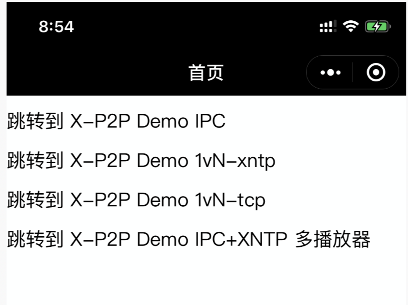
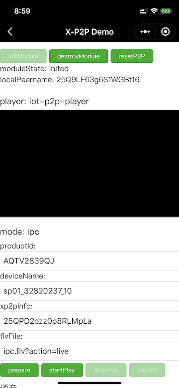
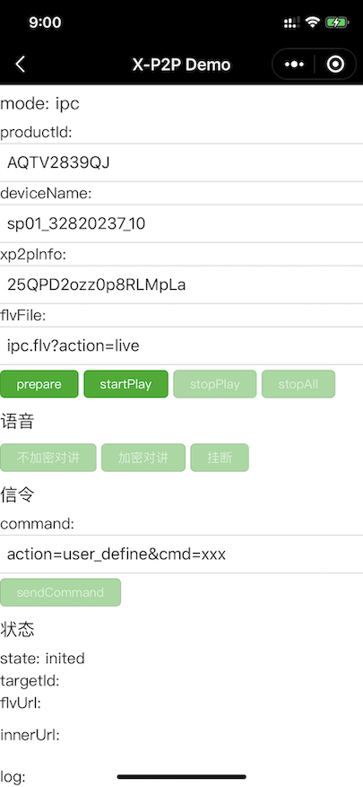
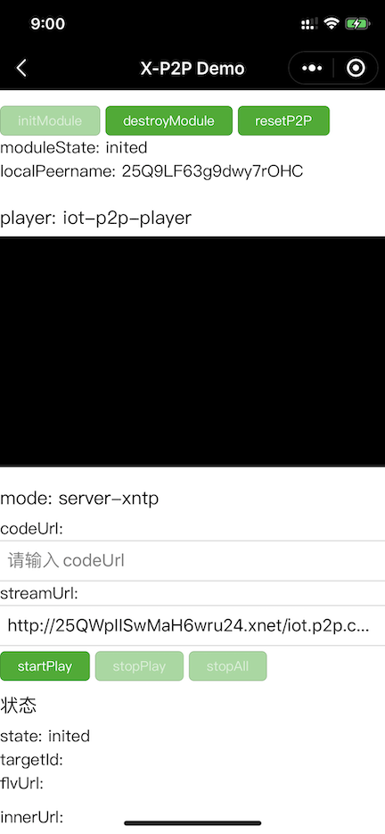

# 腾讯云 IoT Video 小程序 P2P 接入指南

## 介绍

通过腾讯云IoT Video小程序P2P服务，引入 `IoT Video X-P2P插件` 和 `P2P-Player插件`，可实现摄像头和小程序直接打洞传输视频流；配合云端的 Server SDK，可实现小程序和小程序，小程序和APP之间的数据共享。

## 准备工作

- 申请腾讯云 IoT Video P2P 服务，获取访问密钥（联调阶段可直接使用demo里的密钥，正式发布时请使用我们邮件提供给您的正式密钥）
- 向腾讯云IoT Video团队申请使用 [IoT Video X-P2P插件](https://mp.weixin.qq.com/wxopen/pluginbasicprofile?action=intro&appid=wx1319af22356934bf) 和 [IoT Video P2P-Player插件](https://mp.weixin.qq.com/wxopen/pluginbasicprofile?action=intro&appid=wx9e8fbc98ceac2628)
- 有 live-player 的权限，详见 [live-player官方文档](https://developers.weixin.qq.com/miniprogram/dev/component/live-player.html)
- 如果使用语音对讲、双向音视频功能，还需要有 live-pusher 的权限，详见 [live-pusher官方文档](https://developers.weixin.qq.com/miniprogram/dev/component/live-pusher.html)

- 如果使用 1v多 模式，需要将flv流的域名加到小程序的 `request合法域名` 和 `tcp合法域名` 配置中，详见 [服务器域名配置官方文档](https://developers.weixin.qq.com/miniprogram/dev/framework/ability/network.html#1.%20%E6%9C%8D%E5%8A%A1%E5%99%A8%E5%9F%9F%E5%90%8D%E9%85%8D%E7%BD%AE)

## 微信版本限制

微信 8.0.10 以上，基础库 2.19.3 以上

## 开发指引

### 开发文档

- [IoT Video X-P2P插件开发文档](https://mp.weixin.qq.com/wxopen/plugindevdoc?appid=wx1319af22356934bf)
- [IoT Video P2P-Player插件开发文档](https://mp.weixin.qq.com/wxopen/plugindevdoc?appid=wx9e8fbc98ceac2628)
- [Demo源码](./demo/miniprogramIoT)

### 原理介绍

- 0、初始化阶段：

  小程序在启动时就可以调用IoT Video P2P插件的 init 接口，初始化p2p模块，入参填写腾讯云IoT Video分配的appKey和appKeySecret等信息

- 1、小程序用户选择某个摄像头

  1-1：小程序引用IoT Video P2P-Player，返回`livePlayerContext`， 可以直接对`live-player`的context进行操作

  1-2：如果是1v1，小程序调用IoT Video P2P插件的 startP2PService 接口，开始建立p2p连接

- 2、小程序利用`livePlayerContext`触发播放

- 3、插件启动播放：

  3-1：P2P-Player插件抛出拉流事件 playerStartPull 给小程序应用
  
  3-2：小程序应用调用XP2P插件的 startStream 接口，传入需要播放的摄像头ID和播放URL，并设置消息接收回调和数据接收回调

- 4、数据流会通过第3步设置的数据接收回调，传递给P2P-Player插件播放

- 5、小程序用户停止播放

- 6、插件终止播放：

  6-1：小程序调用P2P插件的 stopStream、stopServiceById 终止传输数据

  6-2：小程序Demo或自有小程序操作live-player的context，停止播放

- 7 消耗

  小程序退出时，调用IoT Video P2P插件的 destroy 接口，销毁p2p模块

### 小程序Demo

#### Demo地址

- [源码](./demo/miniprogramIoT)

- 体验二维码

 
 

> 该体验版二维码对应3.x.x版本的xp2p插件
#### Demo使用

注意：Demo UI交互可能更新，但主要流程不变

1）进入主页面

- “X-P2P Demo IPC” 演示1V1 P2P直连摄像头场景
- “X-P2P Demo 1vN-xntp” 和 “X-P2P Demo 1vN-tcp” 演示1V多 P2P场景
- “多播放器” 演示多播放器的调用。

2）1V1 P2P 直连摄像头场景：

- 如果x-p2p插件还未初始化，先点击“initModule”初始化
- 填写“productId”、“deviceName”、“xp2pInfo”，xp2pInfo即设备属性中的 "sys_p2p_info" 字段，可通过 [获取设备属性数据的API](https://cloud.tencent.com/document/product/1131/53100) 获取
- “flvFile”字段可设置播放清晰度，取值参考 [信令交互文档](https://docs.qq.com/doc/DUUhFVlZkc2poUHNl)
- 点击“prepare”和“startPlay”即可开始播放
- 点击“不加密对讲”和“加密对讲”可演示小程序语音对讲，点击“挂断”停止对讲。
- 修改信令command的"cmd=xxx“可演示自定义信令。

3）1V多 P2P 直连场景

- 如果x-p2p插件还未初始化，先点击“initModule”初始化
- 填写“codeUrl”，这是获取密钥的url
- 填写“streamUrl”，这是支持1v多的http-flv视频流
- 点击“startPlay”即可播放视频流

（！注：正式上线时为了server端不暴露UDP端口，请使用1vN-tcp的调用方式。）
